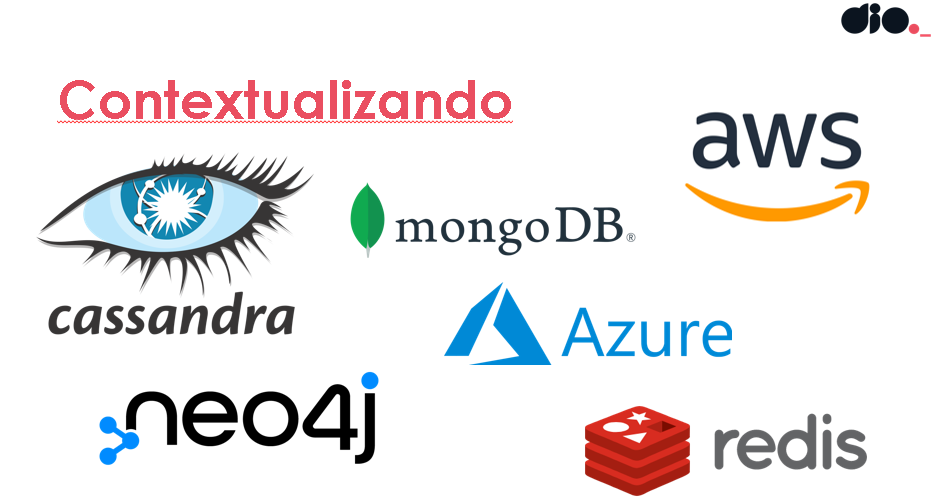
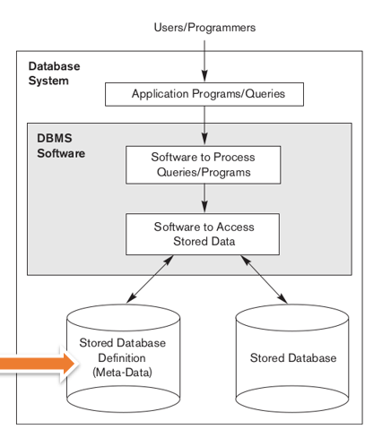
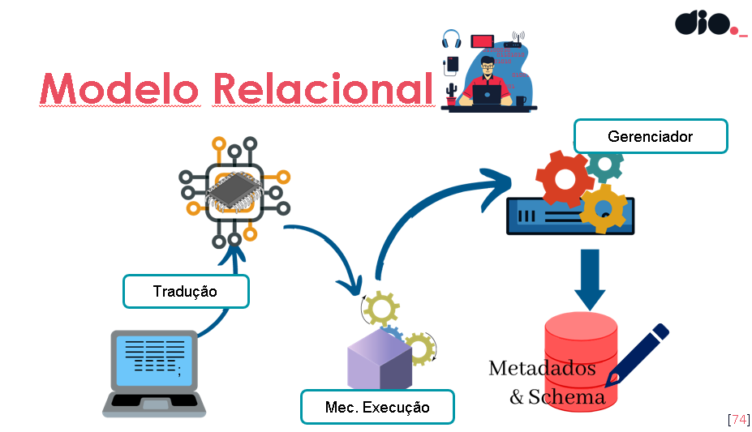

# SQL_CONCEPTS
Show the learning concepts of SQL

# Big Data, Dados e a Relevância do SQL

Neste documento, vamos desmistificar o que são **dados**, entender o fenômeno do **Big Data** e contextualizar a importância contínua da linguagem **SQL** nesse cenário dinâmico.

---

## O Universo dos Dados

Na sua essência, **dados** são representações brutas de fatos, observações ou medições. Eles podem assumir diversas formas: um número, uma palavra, uma imagem, um áudio ou até mesmo um clique em uma página web. Por si só, um dado isolado geralmente tem pouco significado. É quando os dados são coletados, organizados, processados e analisados que se transformam em **informação**, e, por fim, em **conhecimento** capaz de impulsionar decisões.

Pense em exemplos simples:
* `30` (pode ser uma idade, uma temperatura ou a quantidade de itens em estoque)
* `"Rio de Janeiro"` (pode ser uma cidade, um estado ou o nome de um navio)
* A foto de um gato
* O som de uma buzina

Sem contexto, são apenas valores. Com contexto e processamento, eles ganham vida.

---

## O Fenômeno do Big Data

**Big Data** é um termo que descreve o volume exponencial de dados que está sendo gerado em uma velocidade sem precedentes, vindo de uma variedade imensa de fontes e tipos, e que exige tecnologias e métodos de processamento avançados para extrair valor. Não se trata apenas de "muitos dados", mas da complexidade em gerenciá-los e analisá-los com as ferramentas tradicionais.

O Big Data é frequentemente caracterizado pelos seus "Vs":

* **Volume:** A quantidade gigantesca de dados que fluem constantemente. Isso inclui terabytes, petabytes e até exabytes de informações de sensores, mídias sociais, transações online, etc.
* **Velocidade:** A rapidez com que os dados são gerados e processados. Em muitos casos, é necessário processar e analisar dados em tempo real ou quase real para ter insights acionáveis.
* **Variedade:** A diversidade dos tipos de dados. Diferente dos dados estruturados de tabelas tradicionais, o Big Data abrange também dados semiestruturados (como JSON ou XML) e não estruturados (textos livres, imagens, vídeos, áudios).
* **Veracidade:** A qualidade e a confiabilidade dos dados. Com tantas fontes e volumes, garantir que os dados sejam precisos e fidedignos é um desafio crucial.
* **Valor:** O objetivo final de tudo isso: a capacidade de extrair insights valiosos que possam levar a melhores decisões de negócios, otimização de processos e criação de novas oportunidades.

A explosão do Big Data foi impulsionada pela ubiquidade da internet, o crescimento dos smartphones, a proliferação de sensores (IoT), as redes sociais e a digitalização de quase todas as interações humanas e empresariais.

---

## SQL: Contexto e Relevância na Era dos Dados

**SQL (Structured Query Language)** é a linguagem padrão para interagir com bancos de dados relacionais. Desde a sua criação, o SQL tem sido a espinha dorsal para o gerenciamento de dados estruturados, permitindo que usuários e aplicações:

* **Definam Dados (DDL - Data Definition Language):** Criar, modificar e excluir a estrutura de bancos de dados, tabelas, índices e visões.
* **Manipulem Dados (DML - Data Manipulation Language):** Inserir novos registros, atualizar informações existentes e excluir dados de tabelas.
* **Consultem Dados (DQL - Data Query Language):** A função mais utilizada do SQL, que permite selecionar e recuperar dados de uma ou mais tabelas com base em critérios complexos (usando o comando `SELECT`).
* **Controlem Dados (DCL - Data Control Language):** Gerenciar permissões de acesso e segurança no banco de dados.

### Onde o SQL se Encaixa no Cenário Atual de Dados e Big Data:

Apesar da ascensão de bancos de dados NoSQL e de outras tecnologias de Big Data, o SQL não perdeu sua relevância; pelo contrário, ele se adaptou e continua sendo uma ferramenta vital:

1.  **Dominância em Dados Estruturados:** Uma vasta quantidade de dados corporativos (transações financeiras, informações de clientes, dados de inventário, etc.) ainda é e continuará sendo armazenada em bancos de dados relacionais. Para esses dados, o SQL é a linguagem de escolha para consulta e manipulação.
2.  **Análise e Relatórios Tradicionais:** Analistas de dados, cientistas de dados e engenheiros de dados dependem fortemente do SQL para extrair, transformar e carregar (ETL) dados para a criação de relatórios, dashboards e análises descritivas que embasam decisões estratégicas.
3.  **Data Warehouses e Data Lakes:** Muitos Data Warehouses, que são repositórios de dados otimizados para análise e decisão, são construídos sobre plataformas relacionais e são intensivamente consultados via SQL. Além disso, mesmo em ambientes de Data Lake (que armazenam dados brutos de diversas fontes), ferramentas como o Hive, Presto e Spark SQL permitem que analistas usem uma sintaxe SQL para consultar grandes volumes de dados armazenados em formatos distribuídos.
4.  **Integração com Ecossistemas de Big Data:** Muitas ferramentas e plataformas de Big Data, como Hadoop e Spark, oferecem interfaces baseadas em SQL (como Hive ou Spark SQL). Isso permite que profissionais com experiência em SQL interajam e extraiam valor de vastos conjuntos de dados, mesmo que não estejam armazenados em um banco de dados relacional tradicional. Essa "SQLização" do Big Data facilita a adoção e a democratização da análise de dados.
5.  **Bancos de Dados Analíticos:** Existem bancos de dados projetados especificamente para análise em grande escala (como o Snowflake, Google BigQuery, Amazon Redshift), que, embora sejam diferentes dos SGBDRs tradicionais, utilizam o SQL como linguagem principal para consultas complexas sobre volumes massivos de dados.

Em resumo, o SQL permanece como uma habilidade fundamental no mundo dos dados. Ele é a ponte que permite que analistas e desenvolvedores extraiam inteligência tanto de bases de dados relacionais legadas quanto de novas plataformas de Big Data, consolidando sua posição como uma linguagem indispensável para navegar e tirar proveito da era da informação.

---
---

# Big Data, Data, and the Relevance of SQL

In this document, we'll demystify what **data** is, understand the phenomenon of **Big Data**, and contextualize the continuing importance of the **SQL** language in this dynamic landscape.

---

## The Universe of Data

At its core, **data** refers to raw representations of facts, observations, or measurements. It can take various forms: a number, a word, an image, an audio clip, or even a click on a webpage. By itself, an isolated piece of data often holds little meaning. It's when data is collected, organized, processed, and analyzed that it transforms into **information**, and ultimately into **knowledge** capable of driving decisions.

Consider simple examples:
* `30` (could be an age, a temperature, or the quantity of items in stock)
* `"Rio de Janeiro"` (could be a city, a state, or the name of a ship)
* A photo of a cat
* The sound of a car horn

Without context, they are just values. With context and processing, they come to life.

---

## The Big Data Phenomenon

**Big Data** is a term describing the exponential volume of data being generated at an unprecedented speed, coming from an immense variety of sources and types, and requiring advanced technologies and processing methods to extract value. It's not just about "a lot of data," but about the complexity of managing and analyzing it with traditional tools.

Big Data is often characterized by its "Vs":

* **Volume:** The colossal amount of data flowing constantly. This includes terabytes, petabytes, and even exabytes of information from sensors, social media, online transactions, etc.
* **Velocity:** The speed at which data is generated and processed. In many cases, data needs to be processed and analyzed in real-time or near real-time to yield actionable insights.
* **Variety:** The diversity of data types. Unlike structured data from traditional tables, Big Data also encompasses semi-structured data (like JSON or XML) and unstructured data (free text, images, videos, audio).
* **Veracity:** The quality and reliability of the data. With so many sources and volumes, ensuring data accuracy and trustworthiness is a crucial challenge.
* **Value:** The ultimate goal: the ability to extract valuable insights that can lead to better business decisions, process optimization, and the creation of new opportunities.

The explosion of Big Data has been driven by the ubiquity of the internet, the growth of smartphones, the proliferation of sensors (IoT), social media, and the digitalization of nearly every human and business interaction.

---

## SQL: Context and Relevance in the Data Era

**SQL (Structured Query Language)** is the standard language for interacting with relational database management systems (RDBMS). Since its inception, SQL has been the backbone for managing structured data, allowing users and applications to:

* **Define Data (DDL - Data Definition Language):** Create, modify, and delete the structure of databases, tables, indexes, and views.
* **Manipulate Data (DML - Data Manipulation Language):** Insert new records, update existing information, and delete data from tables.
* **Query Data (DQL - Data Query Language):** The most frequently used function of SQL, which allows selecting and retrieving data from one or more tables based on complex criteria (using the `SELECT` command).
* **Control Data (DCL - Data Control Language):** Manage access permissions and security within the database.

### Where SQL Fits in the Current Data and Big Data Landscape:

Despite the rise of NoSQL databases and other Big Data technologies, SQL has not lost its relevance; on the contrary, it has adapted and continues to be a vital tool:

1.  **Dominance in Structured Data:** A vast amount of corporate data (financial transactions, customer information, inventory data, etc.) is still, and will continue to be, stored in relational databases. For this data, SQL is the language of choice for querying and manipulation.
2.  **Traditional Analytics and Reporting:** Data analysts, data scientists, and data engineers heavily rely on SQL to extract, transform, and load (ETL) data for creating reports, dashboards, and descriptive analyses that underpin strategic decisions.
3.  **Data Warehouses and Data Lakes:** Many Data Warehouses, which are data repositories optimized for analysis and decision-making, are built on relational platforms and are heavily queried via SQL. Furthermore, even in Data Lake environments (which store raw data from diverse sources), tools like Hive, Presto, and Spark SQL allow analysts to use SQL syntax to query large volumes of data stored in distributed formats.
4.  **Integration with Big Data Ecosystems:** Many Big Data tools and platforms, such as Hadoop and Spark, offer SQL-based interfaces (like Hive or Spark SQL). This enables professionals with SQL expertise to interact with and extract value from vast datasets, even if they are not stored in a traditional relational database. This "SQL-ization" of Big Data facilitates adoption and democratizes data analysis.
5.  **Analytical Databases:** There are databases specifically designed for large-scale analytics (such as Snowflake, Google BigQuery, Amazon Redshift), which, although different from traditional RDBMSs, use SQL as their primary language for complex queries over massive data volumes.

In summary, SQL remains a fundamental skill in the data world. It is the bridge that allows analysts and developers to extract intelligence from both legacy relational databases and new Big Data platforms, solidifying its position as an indispensable language for navigating and leveraging the information age.

# O Que É um Banco de Dados? (What Is a Database?)

## Em Português

### Definição Técnica

Um **banco de dados** é uma coleção organizada e estruturada de informações (dados) que são armazenadas e gerenciadas eletronicamente em um sistema de computador. Mais precisamente, ele é um sistema projetado para armazenar, recuperar, modificar e gerenciar grandes volumes de dados de forma eficiente e segura. A organização dos dados é crucial, permitindo que eles sejam facilmente acessados, manipulados e atualizados.

Um banco de dados não é apenas um recipiente para dados; ele é um componente essencial de um **Sistema de Gerenciamento de Banco de Dados (SGBD - Database Management System - DBMS)**. O SGBD é o software que interage com os usuários finais, aplicações e o próprio banco de dados, fornecendo a interface para todas as operações de dados. Ele gerencia o armazenamento, a segurança, a integridade e o acesso concorrente aos dados.

### Propriedades e Conceitos Chave

* **Estrutura Lógica:** Os dados em um banco de dados são organizados de acordo com um modelo de dados. Os modelos mais comuns incluem:
    * **Modelo Relacional:** Organiza os dados em tabelas (relações), que consistem em linhas (registros) e colunas (atributos). As relações entre os dados são estabelecidas através de chaves primárias e estrangeiras. É o modelo predominante para dados estruturados.
    * **Modelo NoSQL (Não Relacional):** Abrange uma variedade de modelos, como documentos (JSON), chave-valor, colunas largas e grafos. Projetado para flexibilidade, escalabilidade e lidar com grandes volumes de dados não estruturados ou semiestruturados.
* **Esquema (Schema):** Define a estrutura lógica do banco de dados, incluindo nomes de tabelas, nomes de colunas, tipos de dados, chaves primárias, chaves estrangeiras, restrições de integridade, etc. É a "planta" do banco de dados.
* **Integridade dos Dados:** O SGBD impõe regras para garantir a precisão e a consistência dos dados. Isso inclui:
    * **Integridade de Entidade:** Garante que cada registro em uma tabela seja único (geralmente através de chaves primárias).
    * **Integridade Referencial:** Mantém a consistência entre tabelas relacionadas, garantindo que chaves estrangeiras referenciem valores existentes de chaves primárias.
    * **Integridade de Domínio:** Garante que os valores de uma coluna estejam dentro de um conjunto predefinido de valores válidos.
* **Concorrência:** Permite que múltiplos usuários e aplicações acessem e modifiquem os dados simultaneamente sem comprometer a integridade. O SGBD utiliza mecanismos de bloqueio (locking) e controle de transações.
* **Segurança:** O SGBD oferece mecanismos para controlar o acesso aos dados, definindo permissões (quem pode ler, escrever, etc.) e implementando criptografia.
* **Recuperação e Backup:** Bancos de dados são projetados para serem robustos contra falhas. SGBDs fornecem ferramentas para backup de dados e recuperação em caso de falhas de hardware ou software.
* **Linguagens de Banco de Dados:**
    * **Linguagem de Definição de Dados (DDL - Data Definition Language):** Usada para definir a estrutura do banco de dados (ex: `CREATE TABLE`, `ALTER TABLE`, `DROP TABLE`).
    * **Linguagem de Manipulação de Dados (DML - Data Manipulation Language):** Usada para gerenciar os dados dentro das estruturas (ex: `INSERT`, `UPDATE`, `DELETE`, `SELECT`).
    * **Linguagem de Controle de Dados (DCL - Data Control Language):** Usada para gerenciar permissões e segurança (ex: `GRANT`, `REVOKE`).

### Exemplos de Uso

Bancos de dados são a espinha dorsal de quase todas as aplicações de software modernas:
* Sistemas de Gerenciamento de Conteúdo (CMS)
* Aplicações web (e-commerce, redes sociais)
* Sistemas bancários e financeiros
* Sistemas de controle de inventário e vendas
* Aplicações de saúde e registros médicos

---

## In English

### Technical Definition

A **database** is an organized and structured collection of information (data) that is stored and managed electronically within a computer system. More precisely, it is a system designed to store, retrieve, modify, and manage large volumes of data efficiently and securely. The organization of the data is crucial, allowing it to be easily accessed, manipulated, and updated.

A database is not just a container for data; it is an essential component of a **Database Management System (DBMS)**. The DBMS is the software that interacts with end-users, applications, and the database itself, providing the interface for all data operations. It manages the storage, security, integrity, and concurrent access to the data.

### Key Properties and Concepts

* **Logical Structure:** Data in a database is organized according to a data model. The most common models include:
    * **Relational Model:** Organizes data into tables (relations), consisting of rows (records) and columns (attributes). Relationships between data are established through primary and foreign keys. It is the predominant model for structured data.
    * **NoSQL (Non-Relational) Model:** Encompasses a variety of models, such as document (JSON), key-value, wide-column, and graph. Designed for flexibility, scalability, and handling large volumes of unstructured or semi-structured data.
* **Schema:** Defines the logical structure of the database, including table names, column names, data types, primary keys, foreign keys, integrity constraints, etc. It is the database's "blueprint."
* **Data Integrity:** The DBMS enforces rules to ensure the accuracy and consistency of data. This includes:
    * **Entity Integrity:** Ensures that each record in a table is unique (typically through primary keys).
    * **Referential Integrity:** Maintains consistency between related tables, ensuring that foreign keys reference existing primary key values.
    * **Domain Integrity:** Ensures that values in a column fall within a predefined set of valid values.
* **Concurrency:** Allows multiple users and applications to access and modify data simultaneously without compromising integrity. The DBMS uses locking mechanisms and transaction control.
* **Security:** The DBMS provides mechanisms to control data access, defining permissions (who can read, write, etc.) and implementing encryption.
* **Recovery and Backup:** Databases are designed to be robust against failures. DBMSs provide tools for data backup and recovery in case of hardware or software failures.
* **Database Languages:**
    * **Data Definition Language (DDL):** Used to define the database's structure (e.g., `CREATE TABLE`, `ALTER TABLE`, `DROP TABLE`).
    * **Data Manipulation Language (DML):** Used to manage data within the structures (e.g., `INSERT`, `UPDATE`, `DELETE`, `SELECT`).
    * **Data Control Language (DCL):** Used to manage permissions and security (e.g., `GRANT`, `REVOKE`).

### Usage Examples

Databases are the backbone of almost all modern software applications:
* Content Management Systems (CMS)
* Web applications (e-commerce, social media)
* Banking and financial systems
* Inventory and sales control systems
* Healthcare applications and medical records

# O Que é um Sistema de Gerenciamento de Banco de Dados (SGBD)?
## What is a Database Management System (DBMS)?

---

## Em Português

### Definição Técnica

Um **Sistema de Gerenciamento de Banco de Dados (SGBD)** é um software ou um conjunto de programas que permite a **criação, manutenção e utilização de bancos de dados**. Ele serve como uma **interface crucial** entre os usuários finais ou programas de aplicação e o próprio banco de dados. Sua principal função é facilitar a forma como os dados são definidos, armazenados, recuperados, atualizados e gerenciados. O SGBD é o componente responsável por garantir a **integridade**, **segurança**, **consistência** e **disponibilidade** dos dados.

### Funções e Componentes Chave

As principais funcionalidades de um SGBD incluem:

1.  **Definição de Dados (DDL - Data Definition Language):** O SGBD fornece ferramentas para definir o **esquema** do banco de dados, que é a estrutura lógica e física dos dados. Isso abrange a criação de tabelas, índices, visões, tipos de dados e a definição de restrições de integridade. Linguagens como SQL (`CREATE TABLE`, `ALTER TABLE`) são usadas para essa finalidade.

2.  **Manipulação de Dados (DML - Data Manipulation Language):** Permite aos usuários e aplicações interagir com os dados armazenados. Funções como **inserção** (`INSERT`), **atualização** (`UPDATE`), **exclusão** (`DELETE`) e **consulta** (`SELECT`) de registros são gerenciadas pelo SGBD.

3.  **Controle de Acesso e Segurança (DCL - Data Control Language):** O SGBD implementa mecanismos de segurança robustos para proteger os dados contra acesso não autorizado. Isso envolve a gestão de usuários, papéis, permissões (`GRANT`, `REVOKE`) e, em muitos casos, a criptografia de dados.

4.  **Gerenciamento de Concorrência:** Em ambientes multiusuário, onde vários usuários ou processos podem tentar acessar e modificar os mesmos dados simultaneamente, o SGBD usa algoritmos de controle de concorrência (como **bloqueios** - *locks*, e controle de versões) para garantir que as transações sejam executadas de forma consistente e isolada, prevenindo inconsistências e perda de dados.

5.  **Recuperação e Backup:** O SGBD é projetado para ser resiliente a falhas. Ele oferece mecanismos para criar **backups** do banco de dados e restaurá-los em caso de falhas de hardware, software ou corrupção de dados. O **Journaling** (registro de transações) é uma técnica comum para garantir a atomicidade e durabilidade das transações (parte das propriedades **ACID**).

6.  **Otimização de Consultas:** Para garantir a recuperação eficiente de grandes volumes de dados, o SGBD possui um **otimizador de consultas**. Este componente analisa as consultas recebidas, determina o caminho mais eficiente para acessar os dados (considerando índices, estatísticas, etc.) e executa a consulta de forma otimizada.

7.  **Manutenção da Integridade dos Dados:** O SGBD impõe as **restrições de integridade** definidas no esquema do banco de dados (ex: chaves primárias, chaves estrangeiras, restrições `NOT NULL`, `CHECK`), garantindo que os dados permaneçam precisos e consistentes.

### Tipos de SGBDs

Existem diversos tipos de SGBDs, cada um otimizado para diferentes modelos de dados e casos de uso:

* **SGBDs Relacionais (RDBMS):** Os mais comuns, baseados no **modelo relacional** (tabelas, linhas, colunas). Exemplos: MySQL, PostgreSQL, Oracle, SQL Server.
* **SGBDs NoSQL:** Uma categoria que abrange vários modelos (documento, chave-valor, coluna larga, grafo). Projetados para **escalabilidade horizontal**, flexibilidade de esquema e lidar com grandes volumes de dados não estruturados ou semiestruturados. Exemplos: MongoDB (documento), Redis (chave-valor), Cassandra (coluna larga), Neo4j (grafo).
* **SGBDs Orientados a Objetos:** Menos comuns, mas usados em nichos específicos, onde os dados são modelados como objetos.
* **SGBDs Híbridos/Multi-model:** Suportam múltiplos modelos de dados em um único sistema.

Em essência, um SGBD é a **camada de software que orquestra todas as operações de dados**, tornando a manipulação de informações complexas acessível e confiável para aplicações e usuários.

---

## In English

### Technical Definition

A **Database Management System (DBMS)** is a software system or a set of programs that enables the **creation, maintenance, and use of databases**. It serves as a **crucial interface** between end-users or application programs and the database itself. Its primary function is to facilitate how data is defined, stored, retrieved, updated, and managed. The DBMS is the component responsible for ensuring **data integrity**, **security**, **consistency**, and **availability**.

### Key Functions and Components

The primary functionalities of a DBMS include:

1.  **Data Definition Language (DDL):** The DBMS provides tools to define the database **schema**, which is the logical and physical structure of the data. This includes creating tables, indexes, views, data types, and defining integrity constraints. Languages like SQL (`CREATE TABLE`, `ALTER TABLE`) are used for this purpose.

2.  **Data Manipulation Language (DML):** Allows users and applications to interact with the stored data. Functions such as **inserting** (`INSERT`), **updating** (`UPDATE`), **deleting** (`DELETE`), and **querying** (`SELECT`) records are managed by the DBMS.

3.  **Access Control and Security (DCL - Data Control Language):** The DBMS implements robust security mechanisms to protect data from unauthorized access. This involves managing users, roles, permissions (`GRANT`, `REVOKE`), and often includes data encryption.

4.  **Concurrency Control:** In multi-user environments, where multiple users or processes may attempt to access and modify the same data simultaneously, the DBMS uses concurrency control algorithms (such as **locks** and versioning control) to ensure that transactions are executed consistently and in isolation, preventing inconsistencies and data loss.

5.  **Recovery and Backup:** The DBMS is designed to be resilient to failures. It offers mechanisms to create database **backups** and restore them in case of hardware failure, software malfunction, or data corruption. **Journaling** (transaction logging) is a common technique to ensure the atomicity and durability of transactions (part of **ACID** properties).

6.  **Query Optimization:** To ensure efficient retrieval of large volumes of data, the DBMS includes a **query optimizer**. This component analyzes incoming queries, determines the most efficient path to access the data (considering indexes, statistics, etc.), and executes the query optimally.

7.  **Data Integrity Maintenance:** The DBMS enforces the **integrity constraints** defined in the database schema (e.g., primary keys, foreign keys, `NOT NULL`, `CHECK` constraints), ensuring that data remains accurate and consistent.

### Types of DBMSs

There are various types of DBMSs, each optimized for different data models and use cases:

* **Relational DBMS (RDBMS):** The most common type, based on the **relational model** (tables, rows, columns). Examples: MySQL, PostgreSQL, Oracle, SQL Server.
* **NoSQL DBMS:** A category that encompasses various models (document, key-value, wide-column, graph). Designed for **horizontal scalability**, schema flexibility, and handling large volumes of unstructured or semi-structured data. Examples: MongoDB (document), Redis (key-value), Cassandra (wide-column), Neo4j (graph).
* **Object-Oriented DBMS:** Less common, but used in specific niches where data is modeled as objects.
* **Hybrid/Multi-model DBMS:** Support multiple data models within a single system.

In essence, a DBMS is the **software layer that orchestrates all data operations**, making the manipulation of complex information accessible and reliable for applications and users.

# O Modelo Relacional em Bancos de Dados

O Modelo Relacional é um dos modelos mais amplamente utilizados para a organização e gerenciamento de dados em bancos de dados. Ele foi formalmente introduzido em 1970 por Edgar F. Codd.

## Características Principais (Português)

O sucesso e a durabilidade do modelo relacional são atribuídos a um conjunto de características fundamentais:

* **Álgebra Relacional:** É a base teórica e matemática do modelo relacional, fornecendo um conjunto de operações (como seleção, projeção, junção, união, etc.) que permitem manipular os dados de forma precisa e eficiente. A álgebra relacional serve como fundamento para as linguagens de consulta de bancos de dados.
* **Relações:** Os dados são organizados em estruturas bidimensionais chamadas "relações", que são comumente conhecidas como **tabelas**. Cada tabela consiste em linhas (registros ou tuplas) e colunas (atributos ou campos). As relações entre diferentes tabelas são estabelecidas através de chaves (primárias e estrangeiras), o que permite a integridade e a consistência dos dados.
* **TAD para Armazenamento (Tipos Abstratos de Dados):** O modelo frequentemente lida com a abstração dos dados através de Tipos Abstratos de Dados, o que significa que o usuário interage com os dados em um nível lógico, sem a necessidade de conhecer os detalhes de sua implementação física ou armazenamento. Isso promove a independência de dados.
* **Transparência:** O modelo relacional oferece um alto grau de transparência para o usuário. Isso significa que o usuário não precisa se preocupar com os detalhes de como os dados são fisicamente armazenados ou otimizados. As consultas são focadas no que deve ser recuperado, e não em como deve ser feito.

### SQL e o Modelo Relacional

A linguagem **SQL (Structured Query Language)** é a linguagem padrão para interagir com bancos de dados relacionais. Ela permite definir a estrutura do banco de dados (DDL), manipular os dados (DML), controlar o acesso (DCL) e, principalmente, realizar consultas complexas para extrair informações. A popularidade e a robustez do SQL estão diretamente ligadas à ampla adoção do modelo relacional.

## The Relational Model in Databases

The Relational Model is one of the most widely used models for organizing and managing data in databases. It was formally introduced in 1970 by Edgar F. Codd.

## Key Characteristics (English)

The success and longevity of the relational model are attributed to a set of fundamental characteristics:

* **Relational Algebra:** This is the theoretical and mathematical foundation of the relational model, providing a set of operations (such as selection, projection, join, union, etc.) that allow for precise and efficient manipulation of data. Relational algebra serves as the basis for database query languages.
* **Relations:** Data is organized into two-dimensional structures called "relations," which are commonly known as **tables**. Each table consists of rows (records or tuples) and columns (attributes or fields). Relationships between different tables are established through keys (primary and foreign keys), which ensures data integrity and consistency.
* **ADT for Storage (Abstract Data Types):** The model often deals with data abstraction through Abstract Data Types, meaning the user interacts with data at a logical level without needing to know the details of its physical implementation or storage. This promotes data independence.
* **Transparency:** The relational model offers a high degree of transparency to the user. This means the user does not need to worry about the details of how data is physically stored or optimized. Queries focus on *what* needs to be retrieved, rather than *how* it should be done.

### SQL and the Relational Model

The **SQL (Structured Query Language)** is the standard language for interacting with relational databases. It allows for defining the database structure (DDL), manipulating data (DML), controlling access (DCL), and, crucially, performing complex queries to extract information. The popularity and robustness of SQL are directly linked to the widespread adoption of the relational model.

---

# Processo de Interação com um Banco de Dados Relacional

A interação com um banco de dados baseado no Modelo Relacional envolve várias etapas, desde a entrada da consulta até a recuperação dos dados. Esse processo garante que as operações sejam executadas de forma eficiente e que a estrutura do banco de dados seja respeitada.

## Em Português

### Fluxo de Operação

1.  **Entrada da Consulta:** O processo começa com uma aplicação ou usuário inserindo uma consulta (geralmente em SQL) em um sistema. Essa consulta é uma requisição para manipular ou recuperar dados do banco de dados.

2.  **Tradução:** A consulta recebida, em um formato de alto nível (como SQL), passa por um processo de "Tradução" dentro do Sistema de Gerenciamento de Banco de Dados (SGBD). Nesta fase, a consulta é analisada sintaticamente e semanticamente, e então convertida em um formato de execução mais otimizado. Isso pode envolver a geração de um plano de execução da consulta.

3.  **Mecanismo de Execução:** O plano de execução gerado é passado para o "Mecanismo de Execução" do SGBD. Este componente é responsável por executar as operações de baixo nível necessárias para processar a consulta, como acessar páginas de dados, aplicar filtros, realizar junções e ordenar resultados. Ele interage diretamente com o armazenamento físico dos dados.

4.  **Gerenciador:** Um "Gerenciador" central dentro do SGBD coordena todas as operações. Este componente lida com aspectos como controle de concorrência (garantindo que múltiplas operações não interfiram umas nas outras), gerenciamento de transações (garantindo atomicidade e durabilidade), e controle de acesso e segurança. Ele atua como um maestro para as diversas funções do SGBD.

5.  **Metadados & Schema:** As operações de execução e gerenciamento dependem fundamentalmente dos "Metadados & Schema" do banco de dados. O Schema define a estrutura lógica do banco de dados (tabelas, colunas, tipos de dados, chaves, restrições). Os metadados são "dados sobre dados" e incluem informações sobre a estrutura do banco de dados, índices, estatísticas de distribuição de dados, e permissões. O SGBD consulta constantemente esses metadados para otimizar e validar as operações.

Ao final desse fluxo, os dados solicitados são recuperados ou as modificações são aplicadas, e o resultado é retornado à aplicação ou usuário.

## In English

### Operation Flow

1.  **Query Input:** The process begins with an application or user entering a query (typically in SQL) into a system. This query is a request to manipulate or retrieve data from the database.

2.  **Translation:** The received high-level query (like SQL) undergoes a "Translation" process within the Database Management System (DBMS). In this phase, the query is syntactically and semantically analyzed, then converted into a more optimized execution format. This may involve generating a query execution plan.

3.  **Execution Engine:** The generated execution plan is passed to the DBMS's "Execution Engine." This component is responsible for performing the low-level operations required to process the query, such as accessing data pages, applying filters, performing joins, and sorting results. It directly interacts with the physical data storage.

4.  **Manager:** A central "Manager" within the DBMS coordinates all operations. This component handles aspects such as concurrency control (ensuring multiple operations do not interfere with each other), transaction management (guaranteeing atomicity and durability), and access control and security. It acts as an orchestrator for the various DBMS functions.

5.  **Metadata & Schema:** The execution and management operations fundamentally rely on the database's "Metadata & Schema." The Schema defines the logical structure of the database (tables, columns, data types, keys, constraints). Metadata is "data about data" and includes information about the database structure, indexes, data distribution statistics, and permissions. The DBMS constantly consults this metadata to optimize and validate operations.

At the end of this flow, the requested data is retrieved or modifications are applied, and the result is returned to the application or user.
